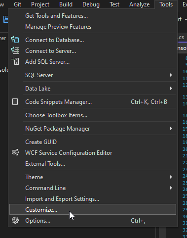
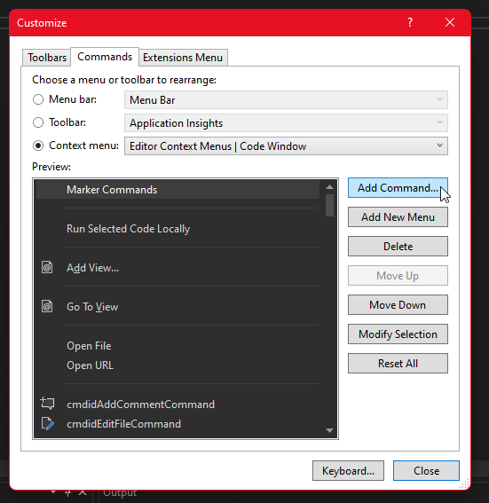
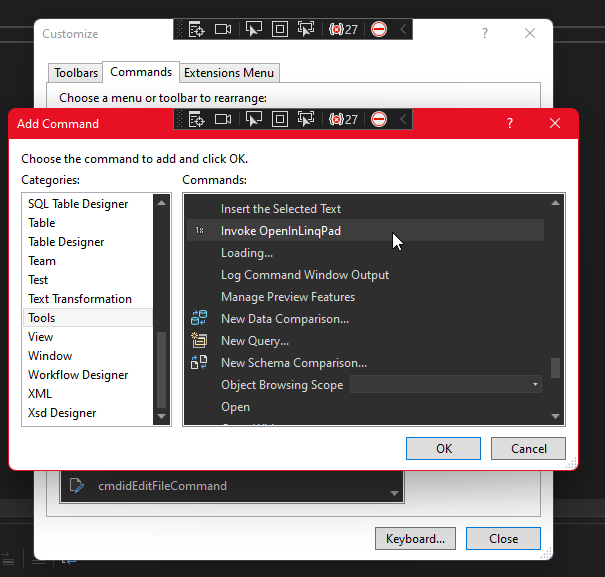
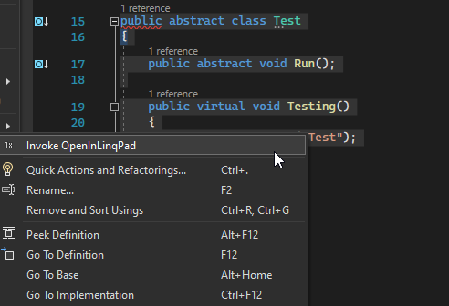

# VS Extension Open Selection In App

## Description

The 'vs extension open selection in app' is an visual studio extension that lets you open your selected code in an external application.

## Installation

To add the command to the editor context menu:
Go to Tools -> Customize -> Commands

Click the "Context menu:" radio button
Select "Editor Context Menus | Code Window"

Click "Add Command..."
Go to Tools
Find OpenInLinqPad

Now close the customize window and you're done.
Select some code and right click the editor code window
Press OpenInLinqPad to see the extension in action

## Future improvements

1. Add a configuration file where users can decide which apps the selection are opened in
2. Direct batch to open text in app instead of an file